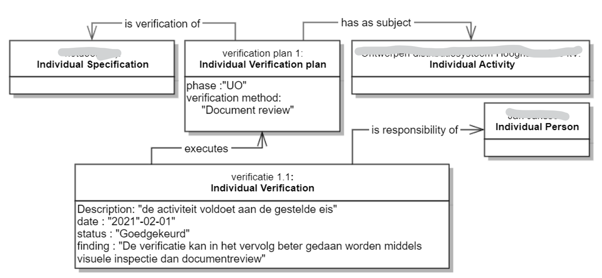

# Eisen

Het eisenformat wordt gebruikt om de eisen te kunnen uitwisselen als data. Bij elke kolom is aangegeven wat de vertaling/binding is naar linked data standaarden, hoe vaak deze waarde ingevuld mag worden per eis ("kardinaliteit") en een beschrijving.

Een eis is een [InformationObject](https://bimloket.github.io/nen2660/def#InformationObject) volgens NEN 2660.

## Eisenformat

De tabel wordt in 4 delen getoond in verband met de leesbaarheid van dit document. De laatste rij bevat een voorbeeld uitwerking.

<table class="wikitable" style="text-align:left; valign:top">
<tr>
<th> [=EisURI=]
</th>
<th> [=EisCode=]
</th>
<th> [=EisNaam=]
</th>
<th> [=EisTekst=]
</th>
<th> [=EisToelichting=]
</th>
</tr>
<tr>
<td> In deze kolom staat de unieke identifier (URI) van de eis. </td>
<td> In deze kolom staat de code of het nummer van de eis. </td>
<td> In deze kolom staat de de naam oftewel de titel van de eis. </td>
<td> In deze kolom staat de eistekst. </td>
<td> In deze kolom staat de toelichting op de eis. </td>
</tr>
<tr>
<td> https://bimloket.github.io/COINS-3.0-Contract-als-data/#voorbeeldeis </td>
<td> EIS1099 </td>
<td> Voorbeeldeis </td>
<td> Dit is de tekst van de voorbeeldeis </td>
<td> Dit is de toelichting van de voorbeeldeis, om achtergrond / doel en reden van de eis te kunnen verduidelijken </td>
</td>
</tr>
</table>
 
 
<table class="wikitable" style="text-align:left; valign:top">
<tr>
<th> [=VerificatieplanURI=]
</th>
<th> [=VerificatieplanNaam=]
</th>
<th> [=Verificatiemethode=]
</th>
<th> [=VerificatieFase=]
</th>
<th> [=VerificatieToelichting=]
</th>
</tr>
<tr>
<td>In deze kolom staat de URI van een verificatieplan bij de eis.</td>
<td>In deze kolom staat de naam van het verificatieplan.</td>
<td>In deze kolom staat de verificatiemethode van het verificatieplan.</td>
<td>In deze kolom staat de fase van het verificatieplan.
<td>In deze kolom staat de toelichting op de verificatiemethode bij de eis.</td>
</tr>
<tr>
<td>https://bimloket.github.io/COINS-3.0-Contract-als-data/#voorbeeldverificatieplan</td>
<td>Voorbeeldverificatieplan.</td>
<td>Een verificatiemethode</td>
<td>Een fase 
<td>Een toelichting waarom een verificatiemethode wordt gevraagd bij de eis, of nadere invulling van de verificatiemethode</td>
</tr>
</table>
 
<table class="wikitable" style="text-align:left; valign:top">
<tr>
<th> [=Eis.heeftDeel=]
</th>
<th> [=EisBron=]
</th>
<th> [=EisReferentiedocument=]
</th>
<th> [=ReferentiedocumentLocatie=]
</th>
<th> [=Eis.specificeert=]
</th>
</tr>
<tr>
<td> In deze kolom staat de URI van een onderliggende eis. </td>
<td> In deze kolom staat de URI van een bron van de eis. </td>
<td> In deze kolom staat de URI van een gerefereerd document waarin aanvullende eisen staan </td>
<td> In deze kolom wordt aangegeven op welke locatie in een document de eis voorkomt. </td>
<td> In deze kolom staat de URI van het Onderwerp van de eis. </td>
</tr>
<tr>
<td> https://bimloket.github.io/COINS-3.0-Contract-als-data/#voorbeeldeis </td>
<td> https://bimloket.github.io/COINS-3.0-Contract-als-data/#voorbeeldbrondocument </td>
<td> https://bimloket.github.io/COINS-3.0-Contract-als-data/#voorbeeldgerefereerddocument </td>
<td> 4.2</td>
<td> https://bimloket.github.io/COINS-3.0-Contract-als-data/#voorbeeldOnderwerp </td>
</tr>
</table>
 
<table class="wikitable" style="text-align:left; valign:top">
<tr>
<th> [=EisType=]
</th>
<th> [=EisEigenaar=]
</th>
<th> [=FaseEis]
</th>
<th> [=StatusEis=]
</th>
<th> [=StatusEisOnderbouwing=]
</th>
</tr>
<tr>
<td> In deze kolom staat het eistype. </td>
<td> In deze kolom staat de eigenaar van de eis. </td>
<td> In deze kolom staat de fase van de eis. </td>
<td> In deze kolom staat de status van de eis. </td>
<td> In deze kolom staat een toelichting op de status van de eis. </td>
</tr>
</table>

## Details 

### <dfn>EisURI

De URI is de unieke identifier voor de eis binnen het project. Zie [URI conform W3C](https://www.w3.org/wiki/URI). 

Bij de eisen kan verwezen worden naar een eis in een eisenbibliotheek onder [=Bron=]. Daar staat de URI van de eis uit de bibliotheek. Deze URI verwijst naar een openbaar gepubliceerde eis in een bibliotheek, bijvoorbeeld het Provinciaal Contracten Buffet.

De eis in het project moet een andere URI hebben dan de bron. Het is niet dezelfde eis, want deze wordt toegepast in (gekopieerd naar) een andere context.

[URI](https://www.w3.org/wiki/URI)

Cardinaliteit: 1:1

> Een URI maakt het meteen "linked data proof"

### <dfn>EisCode

De EisCode is de naam van de eis in spreektaal, vaak een voor mensen herkenbare code of projectnummer. Deze meestal eenvoudige en soms logisch genummerde Code maakt het mogelijk om in een gesprek naar de eis te verwijzen, zonder de volledige URI te hoeven benoemen.

[skos:notation](https://www.w3.org/2009/08/skos-reference/skos.html#notation)

Cardinaliteit: 1:1

### <dfn>EisNaam

De EisNaam wordt ook wel eens de titel van de eis genoemd, en geeft een voor mensen leesbare  korte duiding van de inhoud van de eis. 

De EisNaam hoeft niet uniek te zijn in het project, daarvoor heeft de eis een URI. Een unieke naam is voor de menselijke lezer vaak wel handig. Soms wordt de EisNaam in applicaties bijvoorbeeld gebruikt bij het visualiseren van de eisenboom. Unieke namen helpen in dat geval.

[skos:prefLabel](https://www.w3.org/2009/08/skos-reference/skos.html#prefLabel)

Cardinaliteit: 1:1

### <dfn>EisTekst

De EisTekst bevat de voor mensen leesbare inhoud van de eis.
Op dit moment worden eisen in een contract meestal niet voorzien van een voor een systeem leesbare eis, zoals bijvoorbeeld een minimale waarde voor een attribuut van een object. Deze "dataficeringsslag" is buiten scope van dit document, omdat dit een verder gevorderd BIM niveau vraagt en dit document juist bedoelt is als opstap naar uitwisseling van data.

In de EisTekst kan verwezen worden naar een referentiedocument, waar aanvullende eisen in staan die gelden binnen het contract. De URI van dit document wordt dan opgenomen in de kolom Referentiedocument.

[rdf:value](https://www.w3.org/TR/rdf-schema/#ch_value)

Cardinaliteit: 1:1

### <dfn>EisToelichting

In deze kolom staat de toelichting op de eistekst

In contracten wordt dit gebruikt om nader te onderbouwen waarom deze eis gesteld wordt.

[skos:note](https://www.w3.org/2009/08/skos-reference/skos.html#note)

Cardinaliteit: 1:1

### <dfn>VerificatieplanUri

De URI is de unieke identifier voor het verificatieplan binnen het project. Zie [URI conform W3C](https://www.w3.org/wiki/URI). 

Cardinaliteit: 0:n

<figure>

<figcaption>Het informatiemodel voor het verificatieplan en de toepassing ervan bij het uitvoeren van een individuele verificatie</caption>
</figure> 

### <dfn>VerificatieplanNaam
In deze kolom staat de naam van een verificatieplan bij de eis.

Cardinaliteit: 1:1 ten opzichte van een verificatieplan

### Enum <dfn>Verificatiemethode

In deze kolom staat de methode waarmee de eis geverifieerd moet worden. Een verificatiemethode is een eigenschap ('property') van een eis in de NEN2660-2. De eigenschap heeft een enumeratie van de verschillende mogelijke methoden, dat wil zeggen dat de gebruiker een lijst kan opstellen met verificatiemethoden en een waarde uit deze lijst kan gebruiken.

Bij uitwisseling mag je uitsluitend de onderstaande lijst gebruiken, zonder zelf uitbreidingen te doen. Als elke opdrachtgever een eigen lijst met eistypen en aspecten gebruikt wordt het inrichten van standaard omgevingen voor de verwerking van contracteisen onnodig bemoeilijkt, waarbij bij elk project een aangepaste lijst moet worden gemaakt.

Classificatie volgens:

1. NEN-EN-ISO 9000:2015 Kwaliteitsmanagementsystemen - Grondbeginselen en verklarende woordenlijst
2. ISO/IEC/IEEE 29148:2018 Systems and software engineering — Life cycle processes — Requirements engineering
3. [Leidraad SE (V2 en 3)](https://www.leidraadse.nl/assets/files/downloads/LeidraadSE/V2/LeidraadSE_def_lowres.pdf)

<dl>
<dt><dfn>Vaststellen
	<dd>Activiteit om een of meer kenmerken en hun karakteristieke waarden te achterhalen
	<dd>Bron: NEN-EN-ISO 9001:2015

<dt><dfn>Beoordelen
	<dd>Vaststelling van de geschiktheid, toereikendheid of doeltreffendheid van een object voor het bereiken van vastgestelde doelstellingen
	<dd>Bron: NEN-EN-ISO 9001:2015

<dt><dfn>Monitoren
	<dd>Vaststellen van de status van een systeem, een proces, een product, een dienst of een activiteit. Bijvoorbeeld zettingen, monitoring van draaiuren t.b.v. optimale vervanging
	<dd>Bron: NEN-EN-ISO 9001:2015

<dt><dfn>Meten
	<dd>Proces om een waarde vast te stellen. o.a. luchtsnelheidmetingen in tunnels, kalenderen van heipalen
	<dd>Bron: NEN-EN-ISO 9001:2015 en Leidraad SE v2

<dt><dfn>Keuren
	<dd>Vaststelling van conformiteit met gespecificeerde eisen. Bijvoorbeeld keuring, ingangs- en uitgangscontrole
	<dd>Bron: NEN-EN-ISO 9001:2015

<dt><dfn>Beproeven
	<dd>Vaststellen volgens eisen voor een specifiek beoogd€ gebruik of toepassing
	<dd>Bron: NEN-EN-ISO 9001:2015

<dt><dfn>Evalueren
	<dd>Beoordelen van de voortgang die behaald is met betrekking tot het bereiken van de doelen
	<dd>Bron: NEN-EN-ISO 9001:2015

<dt><dfn>Analyse
	<dd>o.a. haalbaarheidsanalyse, kosten-batenanalyse
	<dd>Bron: Leidraad SE v2

<dt><dfn>Berekening
	<dd>o.a. sterkteberekeningen
	<dd>Bron: Leidraad SE v2

<dt><dfn>Auditen
	<dd>Audit van bestaande kwaliteitssystemen en -processen (o.a. Technical Inspection Services
	<dd>Bron: Leidraad SE v2

<dt><dfn>Demonstratie
	<dd>o.a. presentatie van de functionaliteiten van een bestaand systeem
	<dd>Bron: Leidraad SE v2

<dt><dfn>Documentbeoordelingen
	<dd>o.a. documentinspecties, reviews, toetsen, ontwerpateliers
	<dd>Bron: Leidraad SE v2

<dt><dfn>Modellering
	<dd>o.a. prestatiemodellen van beschikbaarheid, verkeersmodellen
	<dd>Bron: Leidraad SE v2

<dt><dfn>Simulaties
	<dd>o.a. dienstregelingsimulatie
	<dd>Bron: Leidraad SE v2

<dt><dfn>Referentie
	<dd>o.a. gebruik van gecertificeerde producten
	<dd>Bron: Leidraad SE v2

<dt><dfn>Testen
	<dd>haalbaarheidstesten, FIT, FAT, SIT, SAT
	<dd>Bron: Leidraad SE v2

<dt><dfn>Factory Integration Test
	<dd>o.a. hydraulische en mechanische installaties integraal testen
	<dd>Bron: Leidraad SE v2

<dt><dfn>Factory Acceptance Test
	<dd>o.a. cameratesten in fabrieksopstelling
	<dd>Bron: Leidraad SE v2

<dt><dfn>Site Integration Test
	<dd>o.a. interactietesten tussen installatie- en besturingssystemen
	<dd>Bron: Leidraad SE v2

<dt><dfn>Site Acceptance Test
	<dd>o.a. calamiteitenoefeningen in bijzijn van hulpdiensten
	<dd>Bron: Leidraad SE v2

<dt><dfn>Schouw
	<dd>o.a. visuele opname van projectlocatie
	<dd>Bron: Leidraad SE v2

<dt><dfn>Inspecties
	<dd>o.a. Arbo-inspecties, pompkelderinspecties
	<dd>Bron: Leidraad SE v2
</dd></dl>

[nen2660:verificationMethodType](https://bimloket.github.io/nen2660/def#verificationMethodType)

Cardinaliteit: 0:n ten opzichte van een verificatieplan

### <dfn>VerificatieFase

In deze kolom staat de fase van het verificatieplan. Hierbij worden de volgende fasen onderscheiden:

<dl>
<dt><dfn>Conceptfase
	<dd>Fase om (nieuwe) behoeften van stakeholders te inventariseren en mogelijkheden te beoordelen. De eerste klanteisen en oplossingsrichting worden hier bepaald. De conceptfase kan leiden tot het initiatief voor het ontwikkelen en realiseren van een systeem.</dd>
<dt><dfn>Ontwikkelfase
	<dd>De fase om een systeem te specificeren dat voldoet aan de klanteisen. Aan het eind van de ontwikkelfase ligt er een (startklaar) ontwerp voor het gehele systeem.</dd>
<dt><dfn>Realisatiefase
	<dd>De fase om het systeem te vervaardigen en beproeven. Systeemelementen en deelsystemen worden geïntegreerd tot één geheel.</dd>
<dt><dfn>Gebruiksfase
	<dd>De gebruiksfase is de periode waarin het systeem wordt geëxploiteerd. Hier vinden de  activiteiten plaats die nodig zijn om het systeem te gebruiken zoals beoogd.</dd>
<dt><dfn>Beheer- en onderhoudsfase
	<dd>De periode waarin de ondersteunende activiteiten worden uitgevoerd, die noodzakelijk zijn om het systeem in werking te houden.</dd>
<dt><dfn>Sloopfase
	<dd>De fase om een systeem met bijbehorende operationele diensten en functies buiten werking te stellen en te verwijderen.</dd>
</dl>

[Bron: Leidraad SE versie 2, Hoofdstuk 4](https://www.leidraadse.nl/assets/files/downloads/LeidraadSE/V2/LeidraadSE_def_lowres.pdf)

Cardinaliteit: 0:1 ten opzichte van een verificatieplan

### <dfn>VerificatieToelichting

In deze kolom staat de toelichting op de verificatiemethode.

In contracten wordt dit gebruikt om nader toe te lichten waarom deze verificatiemethode gevraagd wordt.

[skos:note](https://www.w3.org/2009/08/skos-reference/skos.html#note)

Cardinaliteit: 0:1 ten opzichte van een verificatieplan

### <dfn>Eis.heeftDeel

In deze kolom staat de URI van een onderliggende eis.

Hiermee kan een hiërarchie worden aangegeven van de eisenboom zoals gebruikelijk in contracten. Een eis kan meerdere onderliggende eisen hebben, er komen dan meerdere regels met dezelfde eis voor in de eisentabel.

[nen2660:hasPart](https://bimloket.github.io/nen2660/term#hasPart)

Cardinaliteit: 0:n

### <dfn>EisBron

De bron van de eis kan naar twee zaken verwijzen:

1. De URI van de gebruikte eis uit een bibliotheek (indien deze niet gewijzigd is). Deze URI verwijst naar een openbaar gepubliceerde eis in een bibliotheek, bijvoorbeeld het Provinciaal Contracten Buffet. De eis in het project moet een andere URI hebben dan de bron. Het is niet dezelfde eis, want deze wordt toegepast in (gekopieerd naar) een andere context.
2. De URI van een brondocument met herkomst van de eis. Deze uri verwijst naar een document in de documententabel.

[dc:source](..)

Cardinaliteit: 0:n

### Locatie in brondocument

Als zowel een pdf (voor mensen leesbare versie) als een dataset met eisen worden meegenomen, dan staat in deze kolom de naam van een paragraaf in een brondocument .

[rdfs:comment](https://www.w3.org/TR/rdf-schema/#ch_comment)

Cardinaliteit: 0:n

### Referentiedocument

Als in de eistekst wordt verwezen naar een referentiedocument, staat in deze kolom de URI van het gerefereerde document. 

Instructie voor gebruik: omdat nog niet alle partijen in staat zijn om de data helemaal te verwerken, moet je het document wel in de eistekst noemen. De eistekst is leidend. Een ontvanger van de eisenset kan er ook niet van uit gaan, dat de opdracthgever dit altijd in weet te vullen. Als in een eistekst naar een referentiedocument wordt verwezen, kan het zijn dat er geen relatie is gemaakt naar het referentiedocument. 

Voorbeelden: 
* De eis verwijst naar een ontwerp of berekening die van toepassing is.
* De eis verwijst naar een richtlijn, handleiding of norm die van toepassing is.

Deze uri verwijst naar een document in de documententabel.

[rdfs:seeAlso](https://www.w3.org/TR/rdf-schema/#ch_seealso)

Cardinaliteit: 0:n

### <dfn>Eis.specificeert

In deze kolom staat de URI van het Onderwerp van de eis. Een eis kan aan meerdere Onderwerpen gesteld worden, er komen dan meerdere regels met dezelfde eis voor in de eisentabel.

Merk op, dat verwijzing naar de URI de tabel minder makkelijk leesbaar maakt voor de mens. Indien hier ook de naam van het concept zou worden toegevoegd, creeert dit dubbelingen met de onderwerpentabel en daarom mogelijk fouten. Daarom wordt alleen de URI gebruikt.

[nen2660:hasRequirement](https://bimloket.github.io/nen2660/def#hasRequirement)

Cardinaliteit: 0:n

### Enum <dfn>Eistype

In deze kolom staat het eistype. De aspecteisen zijn grotendeels overgenomen uit de [Leidraad SE v3](https://www.leidraadse.nl/assets/files/downloads/LeidraadSE/V3/Leidraad_V3_SE_web.pdf); de eistypen die aanduiden aan wat voor concept de eis is gesteld zijn aangepast aan de onderwerpen uit deze richtlijn. 

Bij uitwisseling mag je uitsluitend de onderstaande lijst gebruiken, zonder zelf uitbreidingen te doen. Als elke opdrachtgever een eigen lijst met eistypen en aspecten gebruikt wordt het inrichten van standaard omgevingen voor de verwerking van contracteisen onnodig bemoeilijkt, waarbij bij elk project een aangepaste lijst moet worden gemaakt.

Eistypen:

<dl>
<dt><dfn>Informatie-eis
   <dd>Verzameling van eisen die betrekking hebben op de te leveren informatieproducten
	   
<dt><dfn>Systeemeis
   <dd>De beschrijving van het geheel aan samenhangende of elkaar beïvloedende eisen dat bijdraagt aan het tot standkomen en gebruiken danwel toepassen van het geintegreerde systeem.
   <dd>Bron: Leidraad SE v3 
	 
<dt><dfn>Proceseis
   <dd>De beschrijving van het gevraagde geheel van samenhangende of elkaar beïnvloedende activiteiten dat input omzet in output. 
   <dd>Bron: Leidraad SE v3 

<dt><dfn>Functie-eis
   <dd>De beschrijving van de gevraagde beoogde werking en/of verrichting van een systeem.
 <dd>Bron: Leidraad SE v3 

<dt><dfn>Aspecteis: Betrouwbaarheid
   <dd>De waarschijnlijkheid dat de vereiste functie wordt uitgevoerd onder gegeven omstandigheden gedurende een bepaald tijdsinterval. 
 <dd>Bron: Leidraad SE v3 

<dt><dfn>Aspecteis: Beschikbaarheid
   <dd>De waarschijnlijkheid dat de vereiste functie op een willekeurig moment kan worden uitgevoerd onder gegeven omstandigheden.	
 <dd>Bron: Leidraad SE v3 

<dt><dfn>Aspecteis: Onderhoudbaarheid
   <dd>De waarschijnlijkheid dat de activiteiten voor onderhoud kunnen worden uitgevoerd binnen de hiervoor vastgestelde tijden, onder gegeven omstandigheden teneinde de vereiste functie te kunnen (blijven) uitvoeren.
 <dd>Bron: Leidraad SE v3 

<dt><dfn>Aspecteis: Veiligheid
   <dd>De waarschijnlijkheid dat de vereiste functie en de daarvoor benodigde activiteiten zonder optredend letsel aan personen kan worden vervuld dan wel uitgevoerd en de waarschijnlijkheid dat de integriteit van de functie  en de daaraan verbonden data en datastructuren gewaarborgd blijven van ongewenste beïnvloeding.	   
 <dd>Bron: Leidraad SE v3 

<dt><dfn>Aspecteis: Gezondheid
   <dd>De waarschijnlijkheid dat de vereiste functie en de daarvoor benodigde activiteiten zonder negatieve gezondheidsrisico's voor personen kan worden vervuld dan wel uitgevoerd.
   <dd>Bron: Leidraad SE v3 

<dt><dfn>Aspecteis: Omgeving
   <dd>De waarschijnlijkheid dat de vereiste functie en de daarvoor benodigde activiteiten zonder ongewenste risico's voor de omgeving kunnen wordenvervuld en/of gerealiseerd.	    <dd>Bron: Leidraad SE v3 

<dt><dfn>Aspecteis: Duurzaamheid
   <dd>De waarschijnlijkheid dat de vereiste functie en de daarvoor benodigde activiteiten binnen de hieraan gestelde eisen en PPP (People/Planet/Profit)-doelstellingen kunnen worden gerealiseerd.  
   <dd>Bron: Leidraad SE v3 

<dt><dfn>Aspecteis: Vormgeving
   <dd>De beschrijving van de gevraagde prestatie ten aanzien van het beeld en het materiaalgebruik met inachtneming van de omgevings- en de gezondheidseisen van het systeem en haar onderdelen.
   <dd>Bron: Leidraad SE v3 

<dt><dfn>Aspecteis: Toekomstvastheid
   <dd>De beschrijving van de gevraagde prestatie van een systeem ten aanzien van de vereiste levensduur van het systeem (als functie en als object) en haar onderdelen.	    <dd>Bron: Leidraad SE v3 

<dt><dfn>Aspecteis: Sloopbaarheid
   <dd>De waarschijnlijkheid dat de vereiste functie aan het einde van de levensduur op beheerste wijze kan worden teruggebracht tot minimaal secundaire grondstoffen en met inachtneming van de overige RAMSHE-aspecten.  
   <dd>Bron: Leidraad SE v3 
</dd></dl>

[Onbekend](#issue36)

Cardinaliteit: 0:n

	

### Enum <dfn>EisFase

In deze kolom staat de fase van de eis. Hierbij worden dezelfde fasen onderscheiden als bij de [=VerificatieFase=]

Cardinaliteit: 0:1 

### Enum <dfn>Status

In deze kolom staat de status van de eis. Voor contractspecificaties geldt dat de status één van deze twee zaken is: actueel of vervallen.
Doel is om wijzigingen door een Nota van Inlichtingen of een contractuele wijziging in de eisenset te kunnen opnemen en met elkaar uit te wisselen.

[nen2660:hasState](https://bimloket.github.io/nen2660/term#hasState)

Cardinaliteit: 1:1

### Onderbouwing status

In deze kolom staat een toelichting op de status van de eis.
Gebruikers willen de reden van vervallen toevoegen aan de eis, zodat de status onderbouwd is.

[SKOS:note](https://www.w3.org/2009/08/skos-reference/skos.html#note)

Cardinaliteit: 0:1
