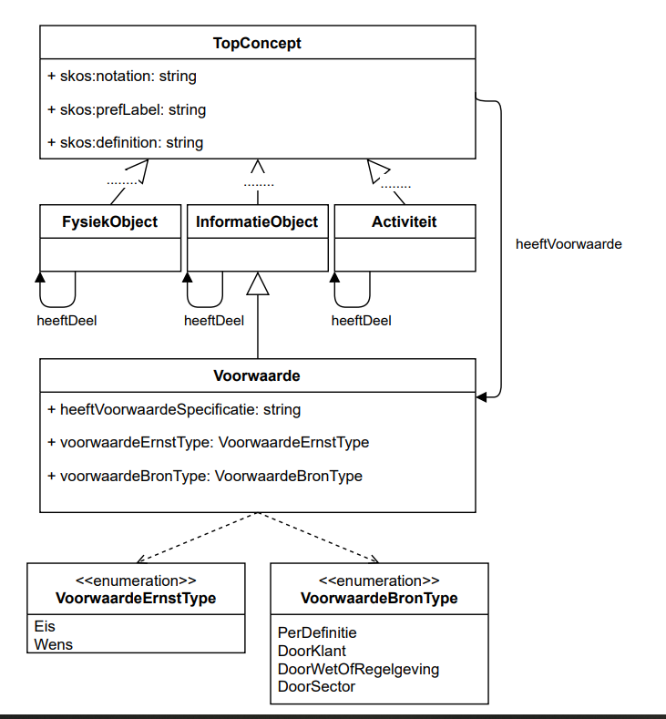

# Inleiding

Een contract is een de uitvraag of overeenkomst waarmee een asset manager zijn ontwerp-, bouw- of onderhoudswerk overeenkomt met een marktpartij. Bij het opstellen van een contract gaat grote aandacht uit naar het samenstellen van contractteksten, waarna deze teksten in pdf bestanden gepubliceerd worden. Dit leidt voor opdrachtnemers tot veel werk bij aanbestedingen, omdat de contractdocumenten allemaal moeten worden doorzocht op eisen, risico’s, uit te voeren werkzaamheden, enzovoorts. Bijvoorbeeld eisen aan het bouwwerk, eisen aan het werkproces van het project of eisen aan informatieleveringen. Als de eisen als data zouden worden aangeboden kunnen deze beter worden ingelezen in de projectbeheersingsomgevingen van opdrachtnemers. Ook zouden in meerdere projecten gebruikte eisen kunnen worden herkend en automatisch verwerkt in de planning van een project.

Onderdelen van een [contract](https://bimloket.github.io/COINS-3.0-Contract-als-data/#dfn-contract) zijn: 
* Juridische grondslag, bijvoorbeeld de UAV of de UAV-gc
* Vraagspecificatie Eisen met eisen aan het Bouwwerk
* Vraagspecificatie Proces met eisen aan het proces
* Informatieleveringsspecificatie met eisen aan de informatieleveringen, soms onderdeel van Vraagspecificatie Proces
* Een referentie-ontwerp, berekening of een voorgeschreven ontwerp
* Bij UAV: ook resultaatsbeschrijvingen met werkzaamheden en hoeveelheden van objecten/materialen). 

Dit document bevat een vertaling van het conceptuele model van NEN 2660 - Regels voor informatiemodellering van de gebouwde omgeving - naar eistabellen die gebruikt kunnen worden voor uitwisseling van contractuele eisen. Het gaat specifiek om de UAV-GC contracten waarin eisen staan (functionele specificaties) in de volgende documenten, die door elke opdrachtgever anders genoemd worden:
* Vraagspecificatie Proces
* Vraagspecificatie Eisen
* Informatieleveringsspecificatie

Daarnaast wordt een mogelijkheid geboden om de overige contractuele documenten uit te wisselen per paragraaftekst.

Het betreft hier een eerste, eenvoudige afspraak over uitwisseling van contractuele eisen, waarmee alle partijen met hun huidige applicaties uit de voeten kunnen.
Het uitwisselen van het referentieontwerp of andere digitale bouwwerkinformatie is buiten scope van deze werkafspraak.

# NEN-2660

Dit schema is nog niet aangepast na publicatie van de ontwerpversie van de NEN 2660 in april 2021
