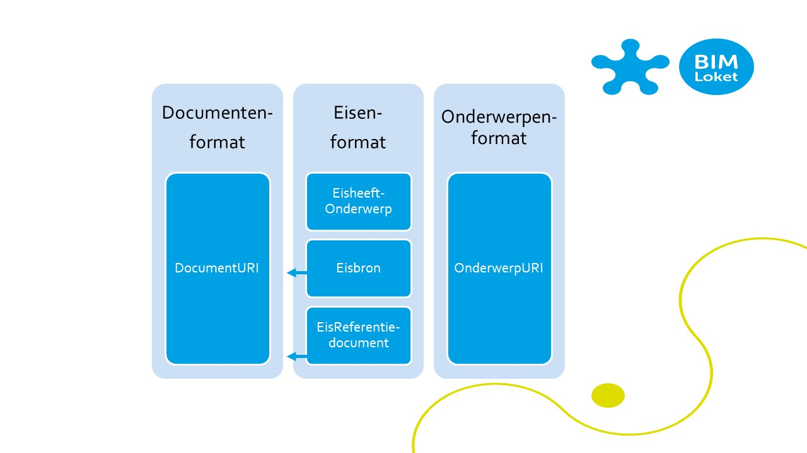

# Inleiding

## Context

<dfn data-lt="Contract|contracten">Contract</dfn>: de uitvraag of overeenkomst waarmee een asset manager zijn ontwerp-, bouw- of onderhoudswerk overeenkomt met een marktpartij. 
	

Bij het opstellen van een [=contract=] gaat grote aandacht uit naar het samenstellen van contractteksten, waarna deze teksten in pdf bestanden gepubliceerd worden. Dit leidt voor opdrachtnemers tot veel werk bij aanbestedingen, omdat de contractdocumenten allemaal moeten worden doorzocht op eisen, risico’s, uit te voeren werkzaamheden, enzovoorts. Bijvoorbeeld eisen aan het bouwwerk, eisen aan het werkproces van het project of eisen aan informatieleveringen. Als de eisen als data zouden worden aangeboden kunnen deze beter worden ingelezen in de projectbeheersingsomgevingen van opdrachtnemers. Ook zouden in meerdere projecten gebruikte eisen kunnen worden herkend en automatisch verwerkt in de planning van een project.

Onderdelen van een [=contract=] zijn:
* Juridische grondslag, bijvoorbeeld de UAV of de <abbr title="Uniforme Algemene Contractvoorwaarden voor Geïntegreerde Contracten">UAV-gc</abbr>
* Een referentie-ontwerp, berekening of een voorgeschreven ontwerp
* Bij UAV-gc: Vraagspecificatie Eisen met eisen aan het Bouwwerk
* Bij UAV-gc: Vraagspecificatie Proces met eisen aan het proces
* Bij <abbr title="Uniforme Algemene Contractvoorwaarden">UAV</abbr>: resultaatsbeschrijvingen met werkzaamheden en hoeveelheden van objecten/materialen. 
* Informatieleveringsspecificatie met eisen aan de informatieleveringen, soms onderdeel van Vraagspecificatie Proces

## Doel van dit document

Dit document heeft als doel om met gebruikers een eenvoudige uitwisselmethode vast te stellen voor [=contractspecificaties=], met tabellen (in CSV), waarmee de meest gangbare applicaties voor eisenmanagement direct uit de voeten kunnen. Voor gebruikers die al verder zijn ontwikkeld op het gebied van interoperabiliteit wordt daarnaast ook uitwisseling in linked data mogelijk gemaakt. 

Desgewenst kunnen gebruikers de [=contractspecificaties=] ook in andere talen uitwisselen, zoals XML, GML, Geopackage of als onderdeel van een VISI bericht. Dat is in dit document niet verder uitgewerkt.

## Scope 

### Binnen scope

Het gaat specifiek om de UAV-GC [=contracten=] waarin eisen staan (functionele specificaties) in de volgende documenten, die door elke opdrachtgever anders genoemd worden:
* Vraagspecificatie Proces: Eisen aan Werkzaamheden
* Vraagspecificatie Eisen: Eisen aan Fysieke Objecten en aan Functies
* Informatieleveringsspecificatie: Eisen aan Informatieproducten

Daarnaast wordt een mogelijkheid geboden om de overige contractuele documenten uit te wisselen per paragraaftekst.

Het betreft hier een eerste, eenvoudige afspraak over uitwisseling van contractuele eisen, waarmee alle partijen met hun huidige applicaties uit de voeten kunnen.
Het uitwisselen van het referentieontwerp of andere digitale bouwwerkinformatie is buiten scope van deze werkafspraak.

### Buiten scope

#### Procesinformatie
Informatie over rollen, taken en verantwoordelijkheden bij het beheren van de eis in de eisenbibliotheek of bij het verwerken in het [=contract=] door het interne team van de opdrachtgever is buiten scope. Voorbeeld: 
* Eisinitiator. De "eigenaar" of "initiator" van een eis is vaak een interne rolhouder. In het [=contract=] gelden hiervoor de projectafspraken en kan de eigenaar vertegenwoordigd zijn door een andere rolhouder. Een eigenaar van een eis kan intern bijvoorbeeld de objectbeheerder zijn, maar in het [=contract=] is de technisch manager eerste aanspreekpunt voor de eis. Meestal wordt de eigenaar niet benoemd in de vraagspecificaties. Daarom is "eigenaarschap" niet opgenomen in de eisentabel.

#### Risico's en raakvlakken
Er is een grote diversiteit aan soorten raakvlakken en risico's en de uitwerking hiervan in het [=contract=]; er is geen eenduidige modellering of standaard tabel, de opdrachtgevers bieden heel variabele [=contracten=] aan op dit gebied. Daarom worden raakvlakken en risico's nog niet opgenomen in de eerste versie van deze specificatie.

## Informatiemodel

Het informatiemodel voor de [=contractspecificaties=] wordt zoveel mogelijk opgesteld met bouwblokken uit andere standaarden. 
De volgende linked data standaarden worden toegepast:

1. Het conceptuele model van [[NEN_2660_2_2022]] - Regels voor informatiemodellering van de gebouwde omgeving. Deze NEN-norm wordt gebruikt als primaire standaard en verwijst in zichzelf ook naar andere standaarden zoals SKOS, RDF-OWL en SHACL. Concepten in de [=contractspecificaties=] die hier niet in staan, maken onder meer gebruik van:
2. Dublin Core ([[DC-RDF]]): een standaard voor het beschrijven van content op het internet. Doel van de Dublin Core is en was om een webdocument kernachtig, met een beperkte verzameling attributen, te beschrijven en op deze manier de metadata over zulke documenten beter uitwisselbaar te maken.

<figure>

<figcaption>UML Schema van een deel van de [[NEN_2660_2_2022]] voor toepassing op uitwisseling van contractuele eisen</caption>
</figure> 

## Uitwisselformats

### CSV

Deze specificatie bevat drie uitwisselformats in de vorm van tabellen, die in csv formaat te vinden zijn op de [Github](https://github.com/bimloket/contractspecificaties). 
1. Een [Eisenformat](https://github.com/bimloket/contractspecificaties/blob/master/Eisentabel.csv), waarin de eis en de verificatiemethoden staan; 
2. Een [Onderwerpenformat](https://github.com/bimloket/contractspecificaties/blob/master/Onderwerpentabel.csv), met daarin de onderwerpen van de eis. Het onderwerp is een FysiekObject, Functie, Werkzaamheid of Informatieproduct
3. Een [Documentenformat](https://github.com/bimloket/contractspecificaties/blob/master/Documententabel.csv), met brondocumenten en gerefereerde documenten. 

<figure>

<figcaption>De drie formats en onderlinge relaties</caption>
</figure> 

### LinkedData
Bij deze contractspecificaties is ook een informatiemodel beschikbaar in linked data. Op basis hiervan kunnen contractspecificaties ook als linked data worden opgesteld. 

## Toepassing

### Machine-leesbaarheid
De formats zijn bedoeld om door een machine te worden ingelezen. 

### Mens-leesbaarheid
Om de formats mens-leesbaar te maken, is dubbele informatie opgenomen in de tabellen: De onderwerpnaam is ingevoegd in het eisenformat en ook in het onderwerpenformat, de documentnaam in opgenomen in het eisenformat (bij bron- en referentiedocumenten) en in het documentenformat.

Voordelen:

* Er kan eenvoudig een menselijke controle plaatsvinden. Zonder dat hiervoor bijv. in Excel met lookup-formules gewerkt hoeft te werken.
* Daarmee wordt het ook mogelijk een daadwerkelijke uitgangscontrole uit te voeren als aanbestedende partij, zonder te moeten vertrouwen op de technische implementatie, wat voor veel eindgebruikers een black-box is.
* Een jurist kan de digitale formats goedkeuren voor deze worden gepubliceert.

Nadelen:

* Informatie wordt dubbel uitgeleverd. Er is een risico dat deze afwijken van elkaar. Een deugdelijke implementatie zou dat moeten voorkomen.
* Het "speciale" karakter van de data-set vermindert. Hierdoor kunnen eindgebruikers in de verleiding komen om last-minute aanpassen in de csv te doen, met kwaliteitsverlies tot gevolg.
 

### Opstellen datasets

De formats of linked datasets kunnen het beste worden opgesteld in een applicatie die de gebruiker ondersteunt bij toepassing van het informatiemodel en het controleren van de volledigheid van de datasset. Bij het handmatig invullen van de tabellen bestaat een grote kans op fouten: dubbel gebruik van <abbr title="Unified Resource Identifiers">URI's</abbr>, ontbrekende verplichte onderdelen, et cetera. 

In een applicatie is het volgende wenselijk:

* Zorg voor een eenvoudige menselijke controle op de tabellen, bijvoorbeeld door in de applicatie extra kolommen toe te voegen die wel de naam van het onderwerp laten zien. Een (juridische) controle door een mens kan op de uitgebreidere tabel plaatsvinden, waarbij de overbodige kolommen kunnen worden verwijderd voor uitwisseling. Daarmee wordt het ook mogelijk een daadwerkelijke uitgangscontrole uit te voeren als aanbestedende partij, zonder te moeten vertrouwen op de technische implementatie, wat voor veel eindgebruikers een black-box is.
 
* Controleer of er in de eisteksten en andere tekstvelden geen codetekens worden gebruikt, die bij uitdraai naar linked data leiden tot interpretatie als code. Onder andere het gebruik van "aanhalingstekens" leidt tot foutmeldingen bij het gebruik van het ttl-formaat. 

#### Tekstvelden
Om te zorgen dat tekstvelden goed geïnterpreteerd kunnen worden zouden in applicaites de volgende regels kunnen worden toegepast:

* Voor [=XML=]: [[xml]]
* Voor [=JSON=]: [[json]]
* Voor [=Turtle=]: [[turtle]]
* Voor [=CSV=] is er geen formele specificatie, er bestaan meerdere interpretaties. Voor dit uitwisselformaat MOET de [=CSV=] voldoen aan de voorwaarden in https://www.w3.org/TR/2015/REC-tabular-data-model-20151217/. 

### Inlezen datasets
De ontvanger van de tabellen kan deze inlezen in de eigen applicatie. Daarbij is het raadzaam om een controle te doen op de integriteit van de tabel: ontbreken van fouten zoals dubbel gebruik van URI's, ontbrekende verplichte onderdelen, et cetera. 

Een ander veelvoorkomen euvel is het gebruik van leestekens en speciale in de teksten in de tabel, die bij uitwisseling worden aangezien voor code, bijvoorbeeld de overgang naar de volgende kolom, of het ontstaan van %#@# gekke tekens in de teksten omdat de ene applicatie uitgaat van html en de andere van platte tekst. Een visuele controle en handmatige aanpassing zal bij gebruik van [=CSV=] als uitwisselformaat altijd nodig zijn.

